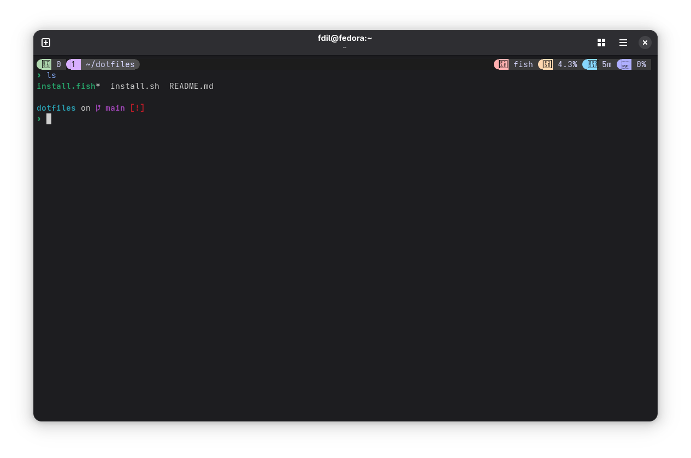
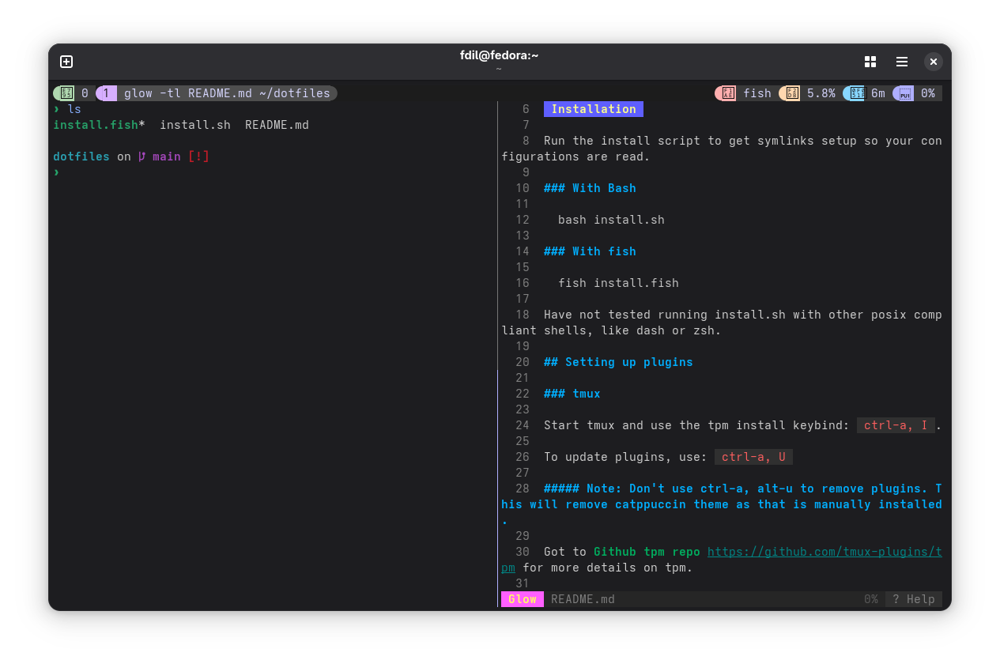
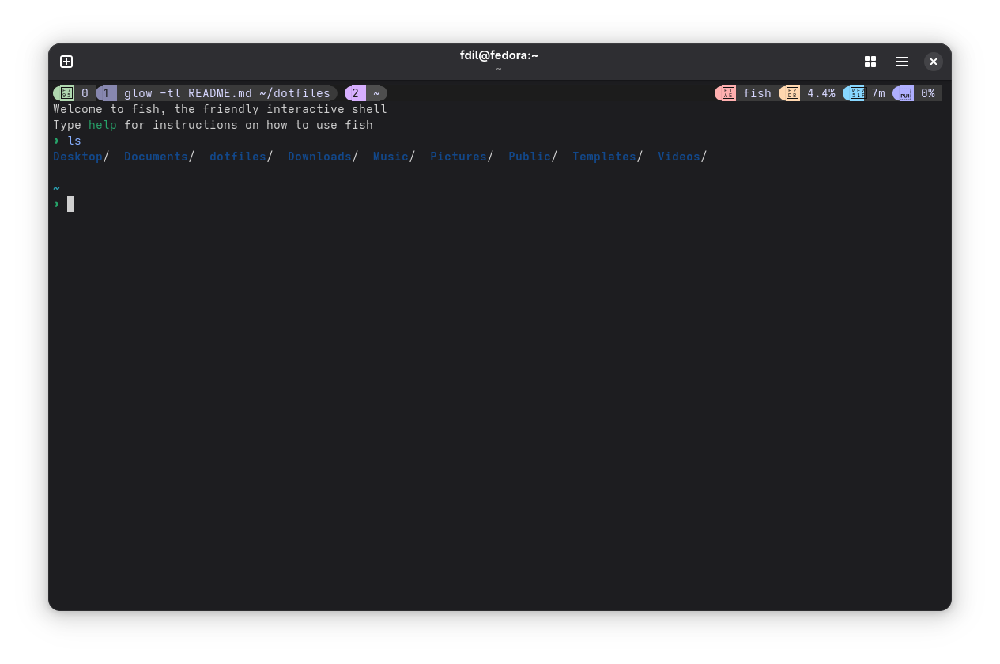
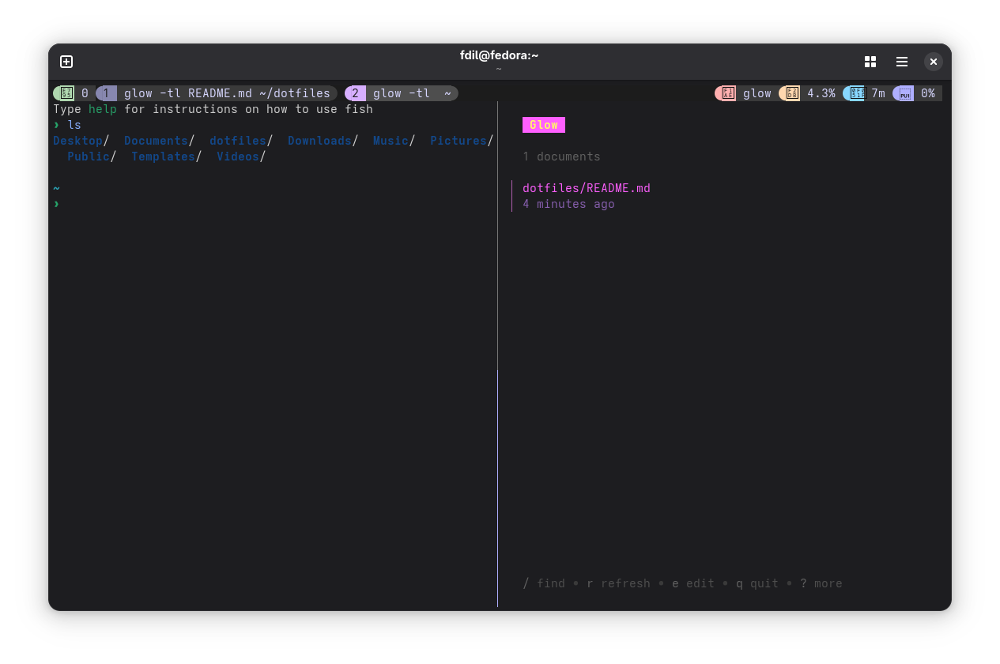
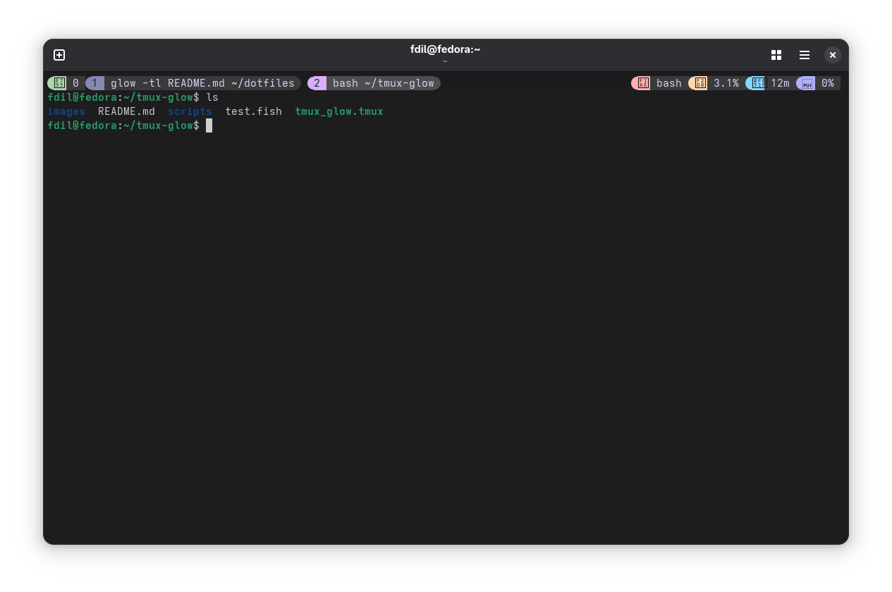
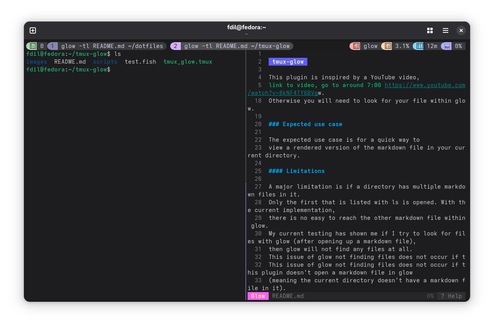

# tmux-glow

This plugin is inspired by a YouTube video, 
[link to video, go to around 7:00](https://www.youtube.com/watch?v=8kNF4TY6BVg)

## What this plugin do?
When you press `prefix + g`, you will create a vertical pane, in which glow is called. 
If you have recently used a markdown file within a command, it will be opened in glow. 
The most recent existing filepath to a .md file from your current directory is opened.
Otherwise glow will be called with no markdown file open (`glow -tl`).

### Example of use case
When editing a markdown in the terminal, you can use this plugin to quickly create a preview pane on the right to see the markdown render while you edit it.

1. You used `vim file.md` to start editing a markdown file
2. Then you press `prefix + g`, this will create a pane on the right with glow opened with file.md

## Requirements
- glow

### glow
This plugin uses glow. 
Not having glow will throw errors when trying to use this plugin as the command won't be found.

[Link to glow GitHub](https://github.com/charmbracelet/glow)


## Installation Part I

### TPM (Recommended)

If you have tpm, add the following line to your tmux.conf file.

```bash
set -g @plugin 'FDIL501st/tmux-glow'
```
Then reload your tmux configurations.
### Manual installation

Choose a location to clone this repo. For these steps we will use `~/.config/tmux/`.

1. Clone the repo:
```bash
git clone https://github.com/FDIL501st/tmux-glow.git ~/.config/tmux/tmux-glow
```

2. Add the following line to your `tmux.conf`:

```bash
run ~/.config/tmux/tmux-glow/tmux_glow.tmux
```

3. Reload your tmux configurations


## Installation Part II

Depending on your default shell (for tmux), you might have to edit your shell configuration files and/or `tmux.conf`.

### bash

#### .bashrc

Add the following lines to `.bashrc` if you don't already have this:

```bash
PROMPT_COMMAND="history -a"
```

Setting `PROMPT_COMMAND` is essential for this plugin to work. What it does is the commands you type are immediatly appended
to your bash history file. This is important as this plugin looks into your bash history file. 
Without setting PROMPT_COMMAND, by default bash will only write your current's session history into your history file when it closes. 
This means when the script looks into your bash history file, without setting `PROMPT_COMMAND`, the script will not be able to view your current session's up to date history.

If you already have set PROMPT_COMMAND without `history -a`, you can add the following line instead:
```bash
PROMPT_COMMAND="history -a; $PROMPT_COMMAND"
```
This will ensure PROMPT_COMMAND has your previous configurations with `history -a` added on top.

#### tmux.conf

##### @glow_bash_histfile

This option might need to be set.
This option controls what file the plugin reads from for your bash command history. 

If your bash history is written in `~/.bash_history`, then you don't need to add this option. That is the default place this plugin looks at.
If your bash history is written somehwhere else, then you will need to add this option. Below is an example if your bash history file is `~./histfile`:

```tmux
set -g @glow_bash_histfile "~./histfile"
```


### zsh

#### .zshrc
Add the following line to `.zshrc` if you don't already have this:

```zsh
setopt INC_APPEND_HISTORY
```
What this does is have your zsh history file immediately have the commands you used append to it, instead of when you close your session (which is default).

This plugin looks into your zsh history file for your recently used commands, 
so the file not being up to date with your session history will make this plugin not work properly.

#### tmux.conf

##### @glow_shell

This is the most important option you need to set. 
Not setting this means the plugin will assume you are using bash.

```tmux
set -g @glow_shell "zsh"
```

##### @glow_zsh_histfile

This option might need to be set.
This option controls what file the plugin looks into for your zsh command history. 

The default file this plugin looks for is `~/.zsh_history`.
If that is where you zsh history is written in, you don't need to set this option.

Below is an example if your zsh history file is `~/.zhistory`:

```tmux
set -g @glow_bash_histfile "~./zhistory"
```


### fish

#### tmux.conf

##### @glow_shell

This is the most important option you need to set. 
Not setting this means the plugin will assume you are using bash.

```tmux
set -g @glow_shell "fish"
```

### Some before and after images of this plugin in action (Outdated images)

Below I have 3 pairs of before and after images. The after is the result of what you see after pressing `prefix + g`.

###### Do ignore the lack of nerdfont in the images. I took the screenshots using my dotfiles test VM, which is I did not fully setup.

#### Before (fish shell with markdown present)

#### After (fish shell with markdown present)


#### Before (fish shell without markdown present)

#### After (fish shell without markdown present)


#### Before (bash shell with markdown present)

#### After (bash shell with markdown present)



## Future plans
### Idea 1
Adding support for more shells, for example Nushell.

### Idea 2
Bringing back support for finding markdown files in the current directory.
I'm thinking of adding this as an option, to change how this plugin finds a markdown file: command history or current directory.


